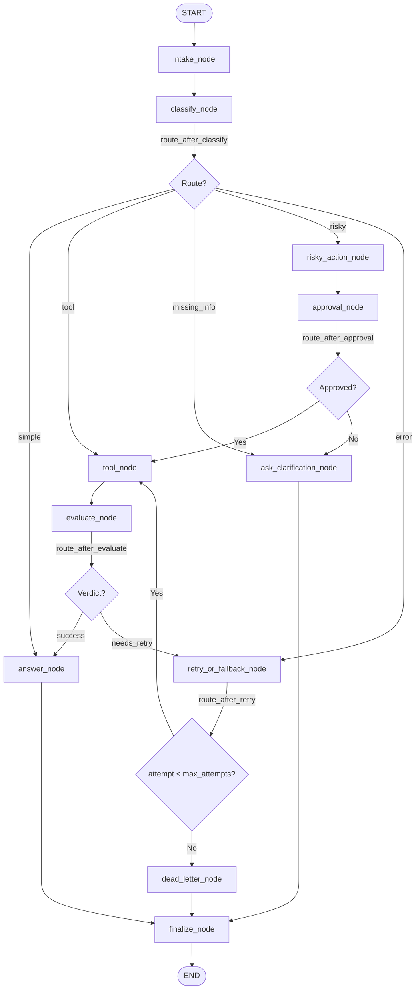

# Hướng Dẫn Hoàn Thiện Bài Lab: LangGraph Agentic Orchestration

Tài liệu này cung cấp hướng dẫn chi tiết từng bước (Step-by-Step Guide) để hiểu context toàn bộ dự án, triển khai mã nguồn, kiểm thử và đạt điểm tối đa (90–100 điểm) cho bài lab **Day 08 Lab — LangGraph Agentic Orchestration**.

---

## 📋 1. Tổng Quan Dự Án & Tiêu Chí Đánh Giá

### 🎯 Mục tiêu
Xây dựng một hệ thống **Support-Ticket Agent** dựa trên **LangGraph** có khả năng:
1. **State Management**: Quản lý trạng thái bằng `AgentState` tuân thủ nguyên tắc `TypedDict`, phân biệt giữa các trường ghi đè (`latest value wins`) và các trường tích lũy nhật ký (`append-only`).
2. **LLM Classification & Grounding**:
   - `classify_node`: Sử dụng LLM với **Structured Output** (Pydantic `Classification`) để phân loại ý định người dùng thành 5 nhánh.
   - `answer_node`: Sử dụng LLM để sinh câu trả lời căn cứ hoàn toàn vào ngữ cảnh (`grounded generation`).
   - `evaluate_node`: Đánh giá kết quả thực thi công cụ bằng LLM-as-judge.
3. **Conditional Routing & Bounded Retries**: Điều hướng động và giới hạn số lần thử lại (`attempt < max_attempts`), đẩy các lỗi không thể xử lý vào luồng `dead_letter`.
4. **Human-In-The-Loop (HITL)**: Phê duyệt thủ công hoặc mock đối với các hành động rủi ro (`risky`).
5. **Persistence**: Tích hợp Checkpointer (`MemorySaver` / `SqliteSaver`) để khôi phục trạng thái theo `thread_id`.
6. **Metrics & Lab Report**: Xuất dữ liệu `outputs/metrics.json` và tạo báo cáo `reports/lab_report.md`.

---

### 📊 Thang Điểm Đánh Giá (Total: 100 Points)

| Danh mục | Điểm | Yêu cầu chính |
|---|---:|---|
| **Architecture & State Schema** | 15 | Khai báo TypedDict đầy đủ các trường, reducer chuẩn (`Annotated[list, add]`), dữ liệu serializable. |
| **Graph Construction & Wiring** | 15 | Đăng ký đầy đủ 11 nodes, nối các cạnh cố định và cạnh điều hướng động, tất cả luồng kết thúc tại `finalize -> END`. |
| **LLM Integration** | 15 | `classify_node` và `answer_node` gọi LLM thực tế (Google Gemini / OpenAI / Anthropic). |
| **Graph Behavior** | 20 | Xử lý đúng 7 kịch bản chuẩn, vòng lặp retry có giới hạn, luồng duyệt HITL hoạt động. |
| **Persistence & Recovery** | 10 | Tích hợp Checkpointer, quản lý theo `thread_id`, có khả năng khôi phục/truy xuất lịch sử. |
| **Metrics & Tests** | 15 | Toàn bộ unit tests trong `tests/` pass, `metrics.json` hợp lệ schema. |
| **Report & Demo** | 10 | Báo cáo `reports/lab_report.md` đầy đủ kiến trúc, bảng metrics và phân tích lỗi. |

---

## 📐 2. Kiến Trúc Luồng Xử Lý (Graph Workflow Diagram)

Dưới đây là sơ đồ luồng dữ liệu và điều hướng trong LangGraph:



---

## 🛠️ 3. Hướng Dẫn Chi Tiết Từng Bước (Step-by-Step Implementation)

---

### Bước 1: Khởi Tạo Môi Trường & Cấu Hình API Key

1. Kiểm tra file [.env](file:///d:/AI_Vinuni/TRACK3_DAY23_DoanDuyChien_2A202601366/.env) tại thư mục gốc. Cấu hình chìa khóa API (Gemini, OpenAI hoặc Anthropic):
   ```env
   GEMINI_API_KEY=AQ.Ab8RN6Ieueg4VV-...
   # Hoặc OPENAI_API_KEY=sk-...
   # Hoặc ANTHROPIC_API_KEY=sk-ant-...
   CHECKPOINTER=memory
   LOG_LEVEL=INFO
   ```
2. Cài đặt các gói phụ thuộc (nếu chưa cài):
   ```bash
   pip install -e ".[dev]"
   pip install langchain-google-genai  # Nếu dùng Gemini
   ```

---

### Bước 2: Định Nghĩa Schema Trạng Thái (`state.py`)

File: [state.py](file:///d:/AI_Vinuni/TRACK3_DAY23_DoanDuyChien_2A202601366/src/langgraph_agent_lab/state.py)

#### 🔹 Kiến thức cần nắm:
- Các trường điều khiển như `route`, `attempt`, `evaluation_result`, `approval` sẽ bị **ghi đè** (`latest value wins`).
- Các trường nhật ký kiểm toán như `messages`, `tool_results`, `errors`, `events` dùng reducer `Annotated[list[...], add]` để **tích lũy** dữ liệu sau mỗi node.

#### 🔹 Cấu trúc chính:
```python
class Route(StrEnum):
    SIMPLE = "simple"
    TOOL = "tool"
    MISSING_INFO = "missing_info"
    RISKY = "risky"
    ERROR = "error"
    DEAD_LETTER = "dead_letter"
    DONE = "done"

class AgentState(TypedDict, total=False):
    thread_id: str
    scenario_id: str
    query: str
    route: str
    risk_level: str
    attempt: int
    max_attempts: int
    final_answer: str | None
    evaluation_result: str       # "success" | "needs_retry"
    pending_question: str | None # Làm rõ đối với missing_info
    proposed_action: str         # Hành động chờ phê duyệt
    approval: dict[str, Any] | None
    
    # Append-only fields
    messages: Annotated[list[str], add]
    tool_results: Annotated[list[str], add]
    errors: Annotated[list[str], add]
    events: Annotated[list[dict[str, Any]], add]
```

---

### Bước 3: Tích Hợp Factory LLM (`llm.py`)

File: [llm.py](file:///d:/AI_Vinuni/TRACK3_DAY23_DoanDuyChien_2A202601366/src/langgraph_agent_lab/llm.py)

Helper `get_llm()` sẽ tự động kiểm tra biến môi trường theo thứ tự ưu tiên:
1. `GEMINI_API_KEY` $\rightarrow$ `ChatGoogleGenerativeAI` (mặc định model `gemini-2.5-flash`)
2. `OPENAI_API_KEY` $\rightarrow$ `ChatOpenAI` (mặc định model `gpt-4o-mini`)
3. `ANTHROPIC_API_KEY` $\rightarrow$ `ChatAnthropic` (mặc định model `claude-sonnet-4-20250514`)

---

### Bước 4: Xây Dựng Các Node Xử Lý (`nodes.py`)

File: [nodes.py](file:///d:/AI_Vinuni/TRACK3_DAY23_DoanDuyChien_2A202601366/src/langgraph_agent_lab/nodes.py)

Triển khai 11 hàm node chính:

1. **`intake_node`**: Chuẩn hóa câu truy vấn ban đầu.
2. **`classify_node`** *(Yêu cầu LLM thực tế)*:
   - Sử dụng `get_llm().with_structured_output(Classification)`.
   - Phân loại truy vấn vào 5 nhóm: `simple`, `tool`, `missing_info`, `risky`, `error`.
   - Có cơ chế fallback bằng từ khóa (`_heuristic_route`) phòng trường hợp LLM gặp sự cố mạng.
3. **`tool_node`**:
   - Mô phỏng gọi tool tra cứu đơn hàng hoặc xử lý tác vụ.
   - Nếu `route == "error"` và `attempt < 2`, mô phỏng lỗi tạm thời (`transient backend failure`).
4. **`evaluate_node`** *(LLM-as-judge)*:
   - Đánh giá xem kết quả từ `tool_node` có chứa từ khóa lỗi hay không, trả về `"success"` hoặc `"needs_retry"`.
5. **`answer_node`** *(Yêu cầu LLM thực tế)*:
   - Tổng hợp kết quả từ `tool_results` và `approval`, gọi LLM để sinh câu trả lời chính xác, căn cứ hoàn toàn vào dữ liệu có sẵn.
6. **`ask_clarification_node`**: Tạo câu hỏi làm rõ khi yêu cầu của người dùng quá mơ hồ (`missing_info`).
7. **`risky_action_node`**: Chuẩn bị mô tả hành động rủi ro cần xin phê duyệt.
8. **`approval_node`** *(HITL)*:
   - Nếu `LANGGRAPH_INTERRUPT=true`, gọi `interrupt()` của LangGraph để dừng chờ con người phản hồi.
   - Ngược lại, thực hiện phê duyệt tự động (mock approval).
9. **`retry_or_fallback_node`**: Tăng biến đếm `attempt += 1` và ghi nhận lịch sử lỗi.
10. **`dead_letter_node`**: Xử lý các kịch bản thất bại sau khi vượt quá `max_attempts`.
11. **`finalize_node`**: Ghi nhận sự kiện kết thúc luồng cho toàn bộ các nhánh.

---

### Bước 5: Định Nghĩa Điều Huống Động (`routing.py`)

File: [routing.py](file:///d:/AI_Vinuni/TRACK3_DAY23_DoanDuyChien_2A202601366/src/langgraph_agent_lab/routing.py)

Viết 4 hàm điều hướng nguyên chất (Pure Functions):

```python
def route_after_classify(state: AgentState) -> str:
    mapping = {
        Route.SIMPLE.value: "answer",
        Route.TOOL.value: "tool",
        Route.MISSING_INFO.value: "clarify",
        Route.RISKY.value: "risky_action",
        Route.ERROR.value: "retry",
    }
    return mapping.get(state.get("route", ""), "answer")

def route_after_evaluate(state: AgentState) -> str:
    if state.get("evaluation_result") == "needs_retry":
        return "retry"
    return "answer"

def route_after_retry(state: AgentState) -> str:
    attempt = state.get("attempt", 0)
    max_attempts = state.get("max_attempts", 3)
    if attempt < max_attempts:
        return "tool"
    return "dead_letter"

def route_after_approval(state: AgentState) -> str:
    approval = state.get("approval") or {}
    if approval.get("approved"):
        return "tool"
    return "clarify"
```

---

### Bước 6: Lắp Ghép & Biên Dịch Đồ Thị LangGraph (`graph.py`)

File: [graph.py](file:///d:/AI_Vinuni/TRACK3_DAY23_DoanDuyChien_2A202601366/src/langgraph_agent_lab/graph.py)

Hàm `build_graph(checkpointer=...)`:
```python
builder = StateGraph(AgentState)

# 1. Đăng ký các Node
builder.add_node("intake", nodes.intake_node)
builder.add_node("classify", nodes.classify_node)
builder.add_node("tool", nodes.tool_node)
builder.add_node("evaluate", nodes.evaluate_node)
builder.add_node("answer", nodes.answer_node)
builder.add_node("clarify", nodes.ask_clarification_node)
builder.add_node("risky_action", nodes.risky_action_node)
builder.add_node("approval", nodes.approval_node)
builder.add_node("retry", nodes.retry_or_fallback_node)
builder.add_node("dead_letter", nodes.dead_letter_node)
builder.add_node("finalize", nodes.finalize_node)

# 2. Đăng ký Cạnh Cố Định & Cạnh Điều Huống
builder.add_edge(START, "intake")
builder.add_edge("intake", "classify")
builder.add_conditional_edges("classify", route_after_classify)

builder.add_edge("tool", "evaluate")
builder.add_conditional_edges("evaluate", route_after_evaluate)

builder.add_edge("risky_action", "approval")
builder.add_conditional_edges("approval", route_after_approval)

builder.add_conditional_edges("retry", route_after_retry)

for node in ("answer", "clarify", "dead_letter"):
    builder.add_edge(node, "finalize")
builder.add_edge("finalize", END)

return builder.compile(checkpointer=checkpointer)
```

---

### Bước 7: Quản Lý Checkpoint & Persistence (`persistence.py`)

File: [persistence.py](file:///d:/AI_Vinuni/TRACK3_DAY23_DoanDuyChien_2A202601366/src/langgraph_agent_lab/persistence.py)

Hỗ trợ các loại Checkpointer:
- `memory`: Sử dụng `MemorySaver()` thích hợp cho kiểm thử bộ nhớ tạm.
- `sqlite`: Sử dụng `SqliteSaver(connection)` lưu xuống file `checkpoints.db`.

---

### Bước 8: Chạy Kịch Bản Scenarios & Đo Lường Metrics

1. Chạy 7 kịch bản từ file [scenarios.jsonl](file:///d:/AI_Vinuni/TRACK3_DAY23_DoanDuyChien_2A202601366/data/sample/scenarios.jsonl):
   ```bash
   .venv\Scripts\python -m langgraph_agent_lab.cli run-scenarios --config configs/lab.yaml --output outputs/metrics.json
   ```
2. Kiểm tra kết quả trong [metrics.json](file:///d:/AI_Vinuni/TRACK3_DAY23_DoanDuyChien_2A202601366/outputs/metrics.json):
   - `total_scenarios`: 7
   - `success_rate`: 1.0 (100%)
   - Phải khớp đúng `expected_route` cho cả 7 kịch bản (`S01` $\to$ `S07`).

3. Cập nhật báo cáo nghiệm thu [lab_report.md](file:///d:/AI_Vinuni/TRACK3_DAY23_DoanDuyChien_2A202601366/reports/lab_report.md).

---

## 🧪 4. Kiểm Thử & Tự Đánh Giá (Verification & Grading)

### 1. Chạy Toàn Bộ Unit Tests
```bash
.venv\Scripts\python -m pytest
```
> **Kết quả kỳ vọng**: `25 passed` (Tất cả 25 test cases trong `test_graph_smoke.py`, `test_routing.py`, `test_state.py`, `test_metrics.py` đều PASS).

### 2. Kiểm Tra Schema Metrics Tự Động
```bash
.venv\Scripts\python -m langgraph_agent_lab.cli validate-metrics --metrics outputs/metrics.json
```
> **Kết quả kỳ vọng**: `Metrics valid. success_rate=100.00%`.

---

## 🚀 5. Hướng Mở Rộng Để Đạt Điểm 90–100 (Bonus Extensions)

Để đạt thang điểm xuất sắc (90–100), bạn nên triển khai ít nhất 1 tính năng mở rộng:

1. **Bật Real HITL Interrupt**:
   Đặt `LANGGRAPH_INTERRUPT=true` trong file `.env`. Sử dụng tính năng `interrupt()` của LangGraph để dừng graph và chờ lệnh tương tác từ phía CLI/UI.
2. **Vẽ Sơ Đồ Đồ Thị LangGraph (Mermaid Diagram)**:
   Thêm đoạn code sau vào cuối `graph.py` hoặc script demo để xuất mã Mermaid:
   ```python
   graph = build_graph()
   print(graph.get_graph().draw_mermaid())
   ```
3. **SQLite Crash Recovery Test**:
   Đặt `CHECKPOINTER=sqlite` trong file `.env`, thực thi kịch bản và khôi phục trạng thái bằng `graph.get_state(config)`.

---

## ❓ 6. Những Lỗi Thường Gặp & Cách Khắc Phục (Troubleshooting)

| Lỗi gặp phải | Nguyên nhân | Cách xử lý |
|---|---|---|
| `ModuleNotFoundError: No module named 'langgraph_agent_lab'` | Python không tìm thấy package dự án. | Chạy với prefix venv: `.venv\Scripts\python -m pytest` hoặc `pip install -e .` |
| `No LLM API key found` | Chưa khai báo API Key trong `.env`. | Mở file `.env` và điền `GEMINI_API_KEY` hoặc `OPENAI_API_KEY`. |
| `Graph loops infinitely (Deadlock)` | `route_after_retry` không kiểm tra `attempt < max_attempts`. | Đảm bảo điều kiện dừng trong `routing.py`: trả về `"dead_letter"` khi vượt quá giới hạn. |
| `Route did not reach finalize node` | Thiếu kết nối cạnh từ 1 node đầu ra về `finalize`. | Kiểm tra `graph.py` đảm bảo `answer`, `clarify`, `dead_letter` đều trỏ tới `finalize -> END`. |

---
*Chúc bạn hoàn thành xuất sắc bài lab LangGraph Agentic Orchestration!*
